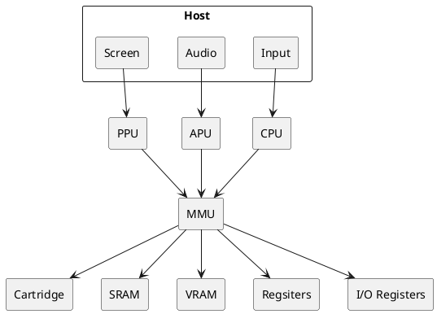

# gameboy
DMG-01 Emulator in Rust

## Emulator Architecture

## Main Control Loop

The host governs the main loop and commands timings among the components. My understanding is that in a real DMG-01 the various units read/write memory safely by only accessing at certain times. For example, writing to VRAM only happens during VBLANK, while reading from it happens during the inverse.

But I'm not fully certain how timing was governed. Something to do with an oscillator. What I think I understand is that we can generally emulate how many "cycles" something takes, so we just track cycle count until we've accumulated enough work, then move on to the next stage. That is, process `x` cycles worth of opcodes, then do some drawing, handle some sound, update interrupts, etc.

I've seen in some emulators, they just loop until an entire frame of work is done, then draw it.

## Rust implementation details

### MMU Sharing
The MMU is the shared resource. Many things want to read/write it (and the data it can access). I first thought to use a RefCell to provide a reference to each unit(CPU, APU, PPU). Given my emulator would be single threaded lock-step operations, this would be fine. There's a runtime cost to ensure only one unit borrows at a time, but there would be no locking issues.

However, I decided to go a simpler route as an attempt to experiment with how embracing rather than fighting the borrow checker changes architecture. My approach is for the MMU to be a top-level resource, owned by the same structure that owns the APU, PPU, CPU. When each unit gets a chance to do work, the MMU is passed in as a mutable borrow.

In terms of code ergonomics, I don't think the RefCell helps much. I can't just do `self.mmu` I could have to do something like `self.borrow()` and litter that everywhere.  Easier to just lend out the MMU, do work, mutating it, and then get it back.

A bonus is that for things that ought to be read only, I can lend out the MMU without `mut` and have greater confidence that the APU or whatnot isn't doing something silly.

### Interrupts

Not yet sure how to do interrupts. I think my main loop will just want to `unit.check_for_interrupt()` and then set the associated flags.

### All state being in MMU
In terms of how the DMG-01 is actually laid out, I'm going to bet the MMU does not actually posess all state.  That is, there's probably registers all over.  But rather than letting registers live with the CPU, I/O devices, etc. I will just make them members of the MMU structure. This makes it simple to look at state of the emulated machine and simplifies the story for save/load state as well.

## TODO:
- don't forget about div counter and timer counter.
