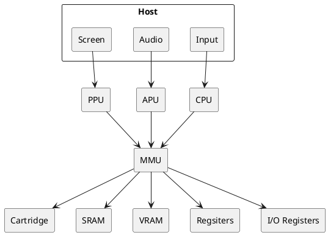

# gameboy
DMG-01 Emulator in Rust

## Emulator Architecture

## Main Control Loop

The host governs the main loop and commands timings among the components. My understanding is that in a real DMG-01 the various units read/write memory safely by only accessing at certain times. For example, writing to VRAM only happens during VBLANK, while reading from it happens during the inverse.

But I'm not fully certain how timing was governed. Something to do with an oscillator. What I think I understand is that we can generally emulate how many "cycles" something takes, so we just track cycle count until we've accumulated enough work, then move on to the next stage. That is, process `x` cycles worth of opcodes, then do some drawing, handle some sound, update interrupts, etc.

I've seen in some emulators, they just loop until an entire frame of work is done, then draw it.

## Rust implementation details
I was thinking of providing access to each

## TODO:
- don't forget about div counter and timer counter.
